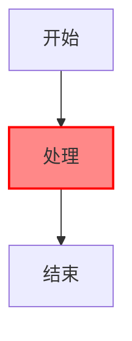
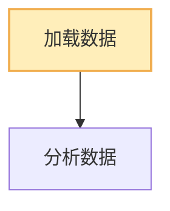
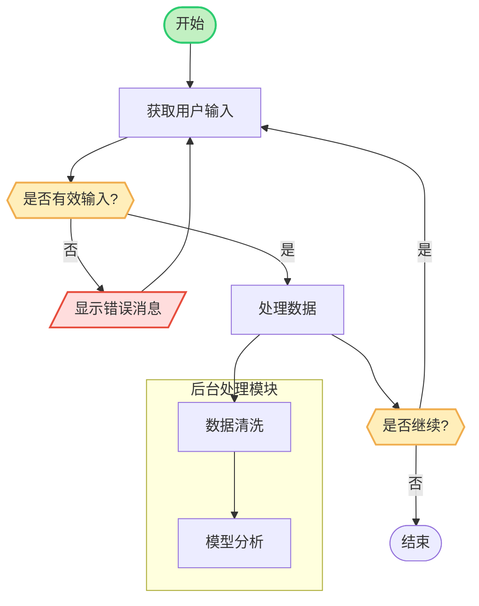
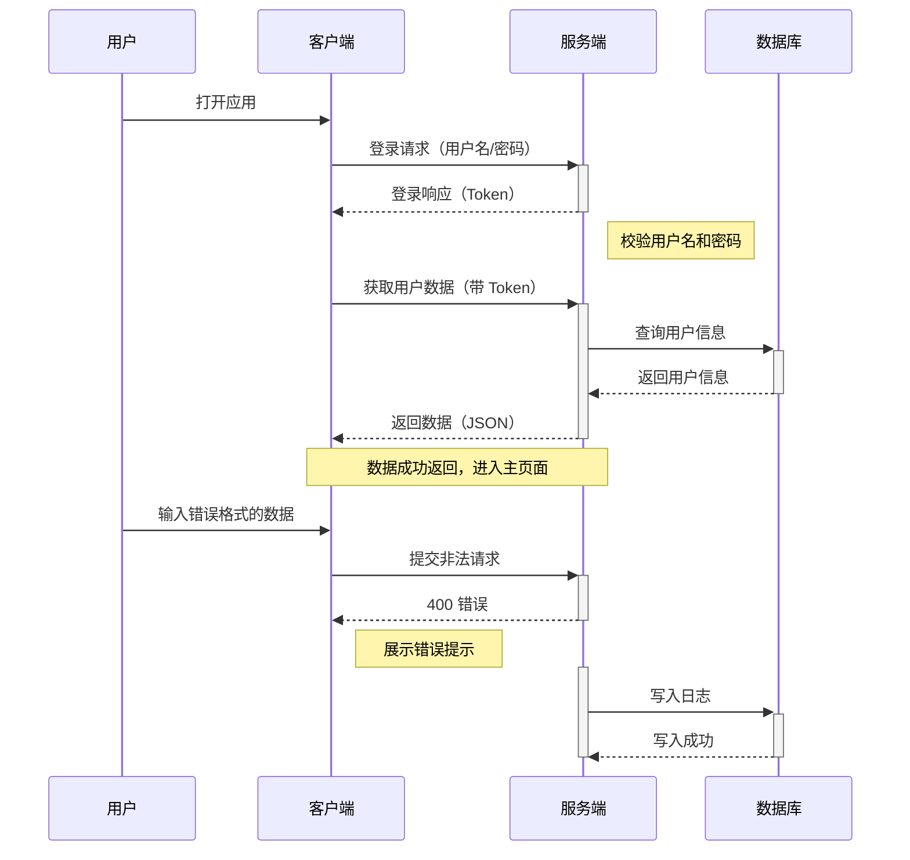
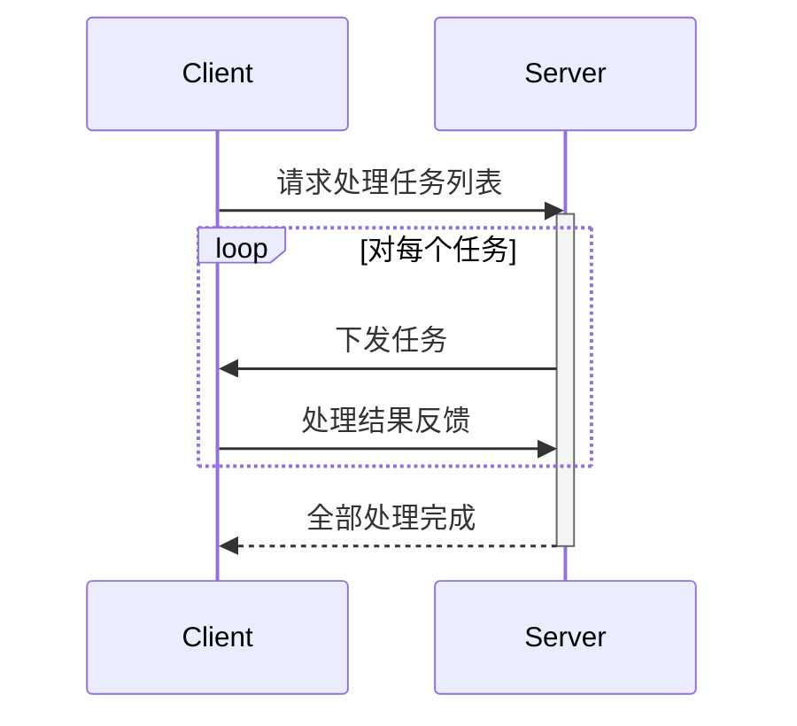
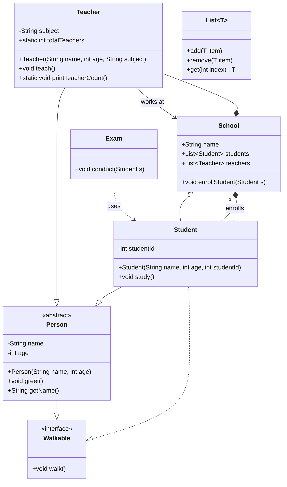

# mermaid

## 1️⃣ 设置节点样式

```code
graph TD
    A[开始] --> B[处理]
    B --> C[结束]
    classDef red fill:#f88,stroke:#f00,stroke-width:2px;
    class B red;
```


```code
flowchart TD
    A[加载数据]:::highlight --> B[分析数据]
    classDef highlight fill:#ffeeba,stroke:#f0ad4e,stroke-width:2px;
```



| 属性           | 示例               | 说明                 |
| -------------- | ------------------ | -------------------- |
| `fill`         | `fill:#f9f,`       | 填充颜色             |
| `stroke`       | `stroke:#333`      | 边框颜色             |
| `stroke-width` | `stroke-width:2px` | 边框粗细             |
| `color`        | `color:#000`       | 字体颜色（部分支持） |
| `font-size`    | `font-size:14px`   | 字体大小（部分支持） |


## 流程图示例

```code
flowchart TD
    %% 节点定义
    Start([开始])
    Input[获取用户输入]
    Decision{{是否有效输入?}}
    Error[/显示错误消息/]
    Process1[处理数据]
    Loop{{是否继续?}}
    End([结束])
    
    %% 箭头连接
    Start --> Input --> Decision
    Decision -- 是 --> Process1
    Decision -- 否 --> Error --> Input
    Process1 --> Loop
    Loop -- 是 --> Input
    Loop -- 否 --> End

    %% 子图
    subgraph 后台处理模块
        A1[数据清洗]
        A2[模型分析]
        A1 --> A2
    end
    Process1 --> A1

    %% 样式定义
    classDef startStyle fill:#c2f0c2,stroke:#2ecc71,stroke-width:2px;
    classDef errorStyle fill:#fdd,stroke:#e74c3c,stroke-width:2px;
    classDef decisionStyle fill:#ffeeba,stroke:#f0ad4e,stroke-width:2px;
    
    class Start startStyle
    class Error errorStyle
    class Decision,Loop decisionStyle
```





## 时序图示例

```code
sequenceDiagram
    %% 角色别名
    participant U as 用户
    participant C as 客户端
    participant S as 服务端
    participant DB as 数据库

    %% 同步、异步调用
    U->>C: 打开应用
    C->>S: 登录请求（用户名/密码）
    S-->>-C: 登录响应（Token）

    Note right of S: 校验用户名和密码

    C->>+S: 获取用户数据（带 Token）
    S->>+DB: 查询用户信息
    DB-->>-S: 返回用户信息
    S-->>-C: 返回数据（JSON）

    Note over C,S: 数据成功返回，进入主页面

    %% 错误分支
    U->>C: 输入错误格式的数据
    C->>+S: 提交非法请求
    S-->>-C: 400 错误
    Note right of C: 展示错误提示

    %% 消息激活标记
    activate S
    S->>+DB: 写入日志
    DB-->>-S: 写入成功
    deactivate S
```




```code
sequenceDiagram
    participant Client
    participant Server

    Client->>Server: 请求处理任务列表
    activate Server

    loop 对每个任务
        Server->>Client: 下发任务
        Client->>Server: 处理结果反馈
    end

    Server-->>Client: 全部处理完成
    deactivate Server
```




## 类图示例


| Mermaid 语法 | 关系类型（UML）                  | 含义描述（详细）                                             |
| ------------ | -------------------------------- | ------------------------------------------------------------ |
| `A -- B`     | 关联（Association）              | 类 A 与类 B 有成员变量或持有关系，没有生命周期绑定；最普通的“有一个”的关系（双向默认） |
| `A --> B`    | 单向关联（Directed Association） | 类 A 以某种方式引用类 B，通常是成员指针或参数（例如 `B* b` 是 A 的成员） |
| `A <-- B`    | 反向单向关联                     | 类 B 引用了类 A，方向与 `A --> B` 相反，B 是持有方           |
| `A *-- B`    | 组合（Composition）              | 类 A 拥有类 B 的实例（值成员），生命周期绑定，A 析构时 B 也随之销毁（例如成员变量 `B b;`） |
| `A o-- B`    | 聚合（Aggregation）              | 类 A 包含类 B，但不负责其生命周期（例如成员为指针或引用），B 可以被多个对象共享 |
| `A ..> B`    | 依赖（Dependency）               | 类 A 短暂依赖类 B，通常表现在函数参数、局部变量、模板参数中，不构成成员关系 |
| `A <.. B`    | 反向依赖（Dependency）           | 类 B 临时依赖类 A，方向反过来，B 在某些上下文中用到 A（例如函数参数） |
| `A --|> B` | 继承（Generalization）        | 类 A 是类 B 的子类，A 继承了 B 的成员函数和属性。通常用于表示具体类继承抽象类或其他基类 |
| `A <|-- B` | 反向继承                         | 类 B 是类 A 的子类，即 B 继承了 A。方向与 `A --|> B` 相反。常用于从子类指向父类的图形表示 |
| `A ..|> B` | 实现（Realization）              | 类 A 实现了接口 B。适用于 A 是具体类、B 是接口类（例如纯虚类或 Java 接口） |
| `A <|.. B` | 反向实现（Realization）          | 类 B 实现了接口 A。箭头从 B 指向 A。即 B 是实现类，A 是被实现的接口或抽象基类 |


```code
classDiagram
%% 类定义，带注释
class Person {
    <<abstract>>
    -String name
    -int age
    +Person(String name, int age)
    +void greet()
    +String getName()
}

%% 接口
class Walkable {
    <<interface>>
    +void walk()
}

%% 类继承与实现
class Student {
    -int studentId
    +Student(String name, int age, int studentId)
    +void study()
}

class Teacher {
    -String subject
    +Teacher(String name, int age, String subject)
    +void teach()
    +static int totalTeachers
    +static void printTeacherCount()
}

%% 关系：继承
Student --|> Person
Teacher --|> Person

%% 关系：实现接口
Person ..|> Walkable
Student ..|> Walkable

%% 关系：关联/聚合/组合
class School {
    +String name
    +List~Student~ students
    +List~Teacher~ teachers
    +void enrollStudent(Student s)
}

%% 聚合（空心菱形）
School o-- Student

%% 组合（实心菱形）
School *-- Teacher

%% 关联
Teacher --> School : works at

%% 多重性
School "1" *-- "many" Student : enrolls

%% 依赖
class Exam {
    +void conduct(Student s)
}

Exam ..> Student : uses

%% 泛型表示
class List~T~ {
    +add(T item)
    +remove(T item)
    +get(int index) T
}
```



